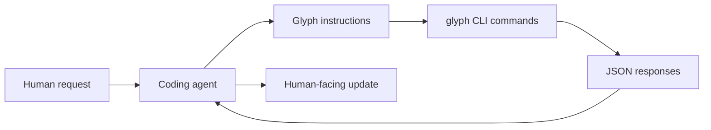

Agents can use Glyph through the CLI without an MCP server. The rules are simple: use `--json`, claim work before writing, checkpoint meaningful progress, publish intentionally, and prune projections after publication.

For full end-to-end command flows, see [Workflow Reference](/docs/cli/workflow-reference). This page focuses on agent behavior and safety.

## Who Runs Glyph?

Glyph is not an autonomous background process in prototype 0. The agent runs it when its project instructions, skill document, or human request tells it to. A human can run the same commands in a terminal.



This is deliberate. The CLI keeps the integration portable across Codex, Claude Code, Cursor, and future agents. A hosted service or MCP server can come later without changing the core source graph model.

## Identity

Use stable actor identifiers in claim commands:

```text
user:self:dhruv
user:org:alice
agent:codex:docs
agent:claude-code:refactor
agent:cursor:ui
```

The provider segment says who owns the identity. For users this can be `self` or an organization. For agents this can be the agent product or runtime.

## Recommended Loop

```sh
glyph status --json
glyph work start auth-fix --from public --json
glyph work claim auth-fix --actor agent:codex:auth-fix --mode exclusive --ttl 30m --json
glyph read auth-fix internal/auth/session.go --json
glyph write auth-fix internal/auth/session.go --reason "fix token expiry" --json < internal/auth/session.go
glyph diff auth-fix --json
glyph checkpoint auth-fix --message "token expiry fixed" --json
glyph work conflicts auth-fix --json
glyph publish auth-fix --to public --mode squash --json
glyph work release auth-fix --actor agent:codex:auth-fix --json
glyph work prune auth-fix --json
```

The loop is explicit because agents should not silently publish or sync remote state. They can freely read, write, diff, and checkpoint inside a work context, but publication and GitHub sync should be intentional workflow steps.

Git usually leaves this distinction to convention: a branch may be scratch work, review work, or public-ready work depending on team habits. Glyph gives agents concrete commands for each state so they can act predictably.

## Concurrency

`glyph work claim` is the coordination point for multi-agent work. An exclusive claim says one actor is actively mutating the work context. A heartbeat extends the claim while long tasks continue.

```sh
glyph work claim docs-update --actor agent:codex:docs --mode exclusive --ttl 30m --json
glyph work heartbeat docs-update --actor agent:codex:docs --ttl 30m --json
```

Before publishing, agents should run:

```sh
glyph work conflicts docs-update --json
glyph hook run pre-publish --work docs-update --to public --mode squash --json
```

## Reading And Writing

`glyph read` and `glyph write` are the agent-native file API. They let an agent operate through source-control semantics rather than relying only on a physical checkout.

```sh
glyph read docs-update docs/overview.mdx --json
glyph write docs-update docs/overview.mdx --reason "document agent loop" --json < docs/overview.mdx
```

Always provide `--reason` for writes. That reason becomes provenance for future review and visualization.

## Direct Filesystem Editing

Agents can still edit files through ordinary filesystem tools when needed. Glyph does not forbid that. The cleaner agent-native path is to use `glyph read` and `glyph write` for changes that should carry source-control provenance.

If an agent edits the project filesystem directly, run `glyph import . --json` to bring those changes back into the source graph according to `glyph.yaml`.

## Publication

Use `squash` for ordinary public updates. Use `preserve` when the intermediate sequence matters, such as security review, multi-agent handoff, or a design investigation whose trail should stay visible.

```sh
glyph publish docs-update --to public --mode squash --json
glyph publish refactor-plan --to maintainers --mode preserve --json
```

## Cleanup

After a work context is published and no longer needed as a projection, prune it:

```sh
glyph work prune docs-update --json
```

Pruning removes the materialized workspace projection. It does not erase the graph history stored in `.glyph/`.
