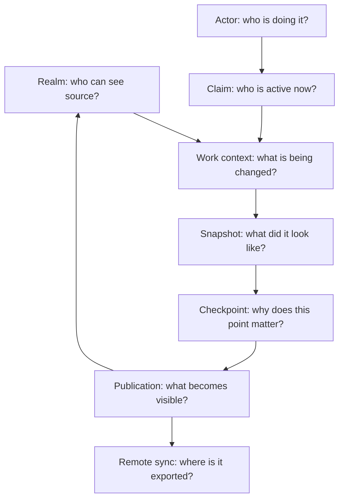
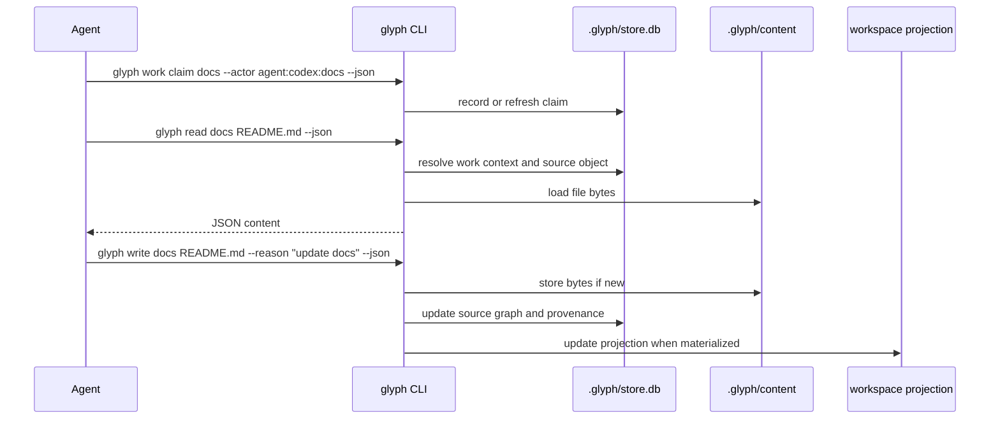
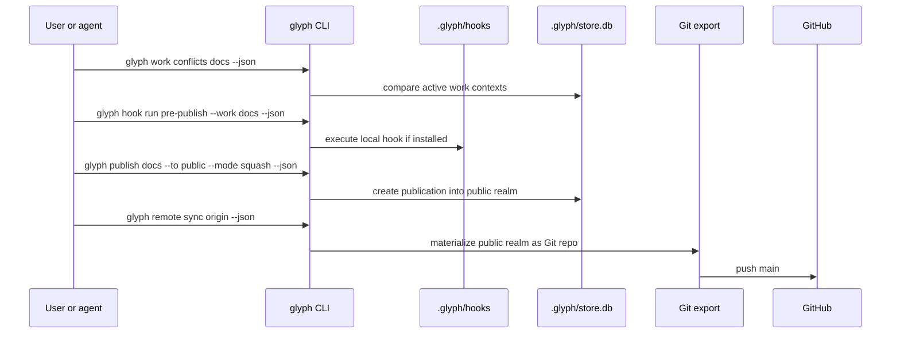
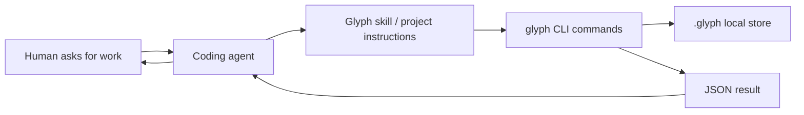

# How Glyph Works

Prototype 0 is a local Go CLI backed by a `.glyph/` directory. There is no hosted Glyph service yet and no long-running daemon required. Humans and agents invoke the `glyph` CLI when they want to read, write, checkpoint, publish, visualize, or export source.

## Core Concepts In One Diagram



If Git is a commit graph plus conventions, Glyph is a source graph with these concepts built in.

## Local Architecture

```mermaid
flowchart TD
  cli["glyph CLI"] --> store[".glyph/store.db"]
  cli --> content[".glyph/content/"]
  cli --> workspaces[".glyph/workspaces/"]
  cli --> hooks[".glyph/hooks/"]
  cli --> exports[".glyph/exports/"]

  store --> graph["source graph metadata"]
  store --> realms["realms"]
  store --> work["work contexts"]
  store --> snapshots["snapshots"]
  store --> publications["publications"]
  store --> claims["claims and conflicts"]

  content --> blobs["deduplicated file bytes"]
  exports --> git["clean Git repository"]
  git --> github["GitHub remote"]
```

`store.db` stores graph structure and metadata. `.glyph/content/` stores file bytes by content identity so repeated file states can share physical storage. The system stores full file states logically, but deduplicates bytes physically.

## What Lives Where

| Path | Role |
| --- | --- |
| `.glyph/store.db` | SQLite database for graph metadata, realms, work contexts, snapshots, claims, publications, remotes, and mounts. |
| `.glyph/content/` | Content-addressed file bytes. |
| `.glyph/workspaces/` | Materialized workspace projections for active work. |
| `.glyph/hooks/` | Local executable hooks. |
| `.glyph/exports/` | Generated compatibility exports, such as clean Git repositories. |
| `glyph.yaml` | Project policy and defaults for imports, exports, and visualizer output. |

## Read And Write Path



The CLI is the control point. An agent does not need shell access to Git internals; it can use `glyph read` and `glyph write` as the source-control API.

## Publication Path



Publication changes a realm. Remote sync exports that realm to GitHub. Those are separate steps so Glyph can keep richer local semantics while still using GitHub infrastructure.

## Does The Agent Run Glyph On Its Own?

Glyph does not autonomously decide to run. Something invokes it:

- a human in a terminal
- a coding agent following project instructions
- a script or CI job
- a future hosted Glyph service

In prototype 0, the recommended agent integration is simple: give the agent a skill or instruction document that says to use `glyph --json`, claim work before editing, checkpoint progress, check conflicts, publish intentionally, and sync remotes only when asked.



This keeps the integration portable across Codex, Claude Code, Cursor, and other agents. A future MCP server or hosted API can provide richer integration, but the CLI is enough to dogfood the model today.
