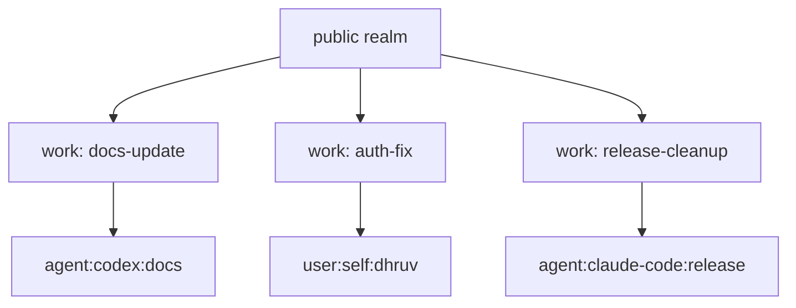

Glyph assumes that many humans and agents may work on the same project at the same time. The model is optimistic: people do not block each other globally, but each active task has a named work context, claims show who is editing, and publication checks whether work can safely land.

Git usually handles this with branches, worktrees, rebases, and pull requests. Those tools work, but they make collaboration a convention layered on top of commits. Glyph puts the collaboration state in the source-control model.

## The Short Version

| Situation | Glyph approach |
| --- | --- |
| Two agents working on different tasks | Use separate work contexts from the same realm. |
| One agent actively editing a task | Claim the work context with `exclusive` mode and heartbeat while working. |
| A human reviewing an agent's task | Inspect the same work context, or use a `shared-read` claim where policy allows it. |
| One task depends on another | Add a dependency edge and publish in dependency order. |
| Two tasks touch the same files | Run conflict checks before publication. |
| Work is done | Publish, then prune the materialized projection. |
| Another device needs the public source | Use the GitHub mirror or a Git export. |
| Another device needs full Glyph history | Copy or sync `.glyph/` only while no process is writing, or wait for remote Glyph store sync in a future version. |

## Multiple Users Or Agents In One Project

Each task should usually get its own work context:

```sh
glyph work start docs-update --from public --json
glyph work start auth-fix --from public --json
glyph work start release-cleanup --from public --json
```

Those contexts can all start from the same `public` realm. They do not need separate Git branches, and they do not fight over one global working tree.



The important habit is to name the task, not the history shape. A branch name often carries several meanings at once: feature, owner, readiness, privacy, and review state. Glyph separates those meanings into work contexts, claims, realms, checkpoints, and publications.

## Claims And Heartbeats

A claim says who is actively responsible for a work context right now.

```sh
glyph work claim docs-update \
  --actor agent:codex:docs-update \
  --mode exclusive \
  --ttl 30m \
  --json
```

Long-running agents should heartbeat:

```sh
glyph work heartbeat docs-update \
  --actor agent:codex:docs-update \
  --ttl 30m \
  --json
```

Release the claim when handing off or pausing:

```sh
glyph work release docs-update \
  --actor agent:codex:docs-update \
  --json
```

Claims are coordination, not ownership. They do not decide who gets credit or who can approve the work. They make active mutation visible so another human or agent can avoid accidentally writing over the same task.

## Same Workspace, Different Actors

Two actors can inspect the same work context, but only one actor should mutate it at a time unless the project has a policy for shared editing.

Recommended pattern:

1. The active editor holds an `exclusive` claim.
2. Reviewers inspect with `glyph diff`, `glyph read`, or a projected copy.
3. The editor checkpoints meaningful states.
4. The editor releases the claim before another actor takes over.

```sh
glyph diff docs-update --json
glyph checkpoint docs-update --message "ready for human review" --json
glyph work release docs-update --actor agent:codex:docs-update --json
glyph work claim docs-update --actor user:self:dhruv --mode exclusive --ttl 2h --json
```

This is different from a shared Git working tree, where the filesystem may show a mixture of unfinished edits and review changes. Glyph wants one work context to have a visible driver at any moment.

## Related Work And Dependencies

Sometimes two contexts are separate but ordered. For example, `api-layer` should publish after `data-layer`.

```sh
glyph work depend api-layer data-layer --json
glyph work conflicts data-layer --json
glyph work conflicts api-layer --json
```

Publish in dependency order:

```sh
glyph publish data-layer --to public --mode squash --json
glyph publish api-layer --to public --mode squash --json
```

Dependencies are not merges. They are intent: this work should be evaluated after that work.

## Conflict Checks

Before publication, check whether another active context overlaps:

```sh
glyph work conflicts docs-update --json
```

Prototype 0 uses conservative path-level conflict detection. If two contexts change the same path differently, publication should stop for human or policy review. Future versions can add semantic conflict detection, but the first rule is simple: do not let concurrent work silently collide.

Public export checks cover a different problem:

```sh
glyph check public --json
```

Conflict checks ask, "Does this work interfere with other active work?" Public export checks ask, "Will the published public projection build and validate?"

## Sharing Work Across Devices

There are three different sharing needs. They should not be mixed up.

### Share The Public Project

Use GitHub or a Git export. This is the stable compatibility path today.

```sh
git clone git@github.com:Illusion47586/glyph.git
```

That clone gives another device the public projection, not the full local Glyph graph. It is enough for reading, building, release artifacts, and ordinary GitHub visibility.

### Continue Public Work On Another Device

Today, the simple path is:

1. Sync the current public realm from the first device:

```sh
glyph check public --json
glyph remote sync origin --json
```

2. On the second device, clone the GitHub mirror and bootstrap a local Glyph store from that public projection:

```sh
git clone git@github.com:Illusion47586/glyph.git
cd glyph
glyph init --json
glyph import . --json
glyph work start next-task --from public --json
```

This preserves the public source state, but not the first device's private snapshots, unpublished work contexts, claims, or maintainer-only realms.

### Move Full Glyph State To Another Device

The full local graph lives in `.glyph/`: store database, content blobs, workspaces, claims, publications, and exports. In prototype 0, there is no hosted Glyph store sync yet.

If you need to move the full local graph today, copy the project directory including `.glyph/` while no Glyph command or editor is writing to it:

```sh
rsync -a --delete ./ other-device:/path/to/glyph/
```

Use this as an offline handoff, not as a live shared database. Do not put one active `.glyph/store.db` on a cloud-synced folder and let multiple devices write to it at the same time. SQLite is reliable for local concurrency, but a Dropbox-style shared database is not a distributed source-control protocol.

## What Hosted Or Remote Glyph Should Add

Future Glyph should make cross-device collaboration first-class:

- remote source graph sync
- per-realm access control
- signed publications
- durable claims with session identity
- stale claim takeover
- conflict records that travel between devices
- remote work context handoff
- policy-controlled private realms

Until then, use GitHub for public projection sharing and treat `.glyph/` as the local canonical store for one active device at a time.

## Recommended Policy

- Use one work context per task.
- Use claims for any task with more than one possible actor.
- Heartbeat during long-running agent work.
- Check conflicts before publishing.
- Add dependencies when publication order matters.
- Publish to a realm before syncing GitHub.
- Prune completed projections after publication.
- Use GitHub for public sharing, not for private Glyph graph state.
- Copy `.glyph/` between devices only as an intentional offline handoff.
