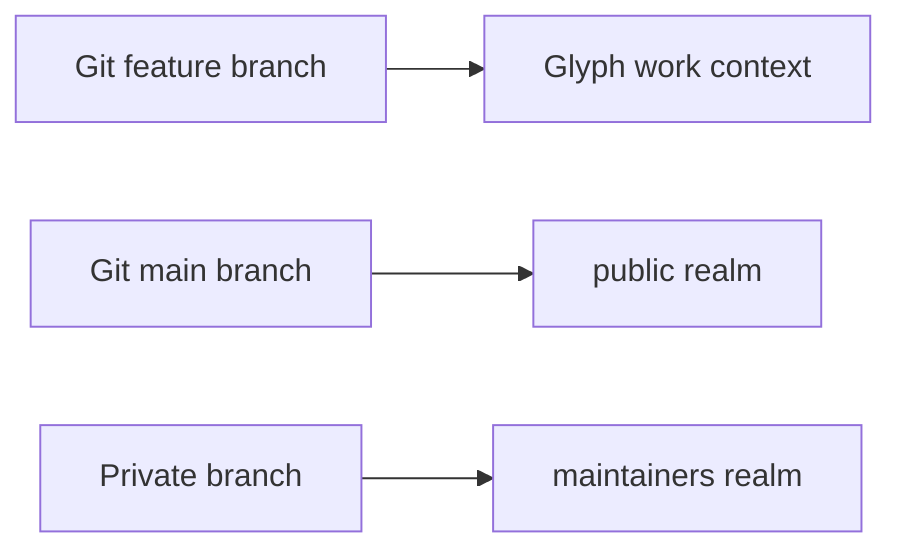
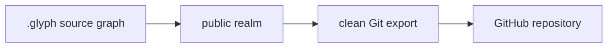

Glyph is canonical. Git and GitHub are compatibility targets.

Git users should read this page as a translation layer, not as a promise that every Git concept survives unchanged. Glyph keeps compatibility at the boundary while using source graph primitives internally.

## Mapping

| Git | Glyph |
| --- | --- |
| commit | publication event, checkpoint, snapshot, or imported provenance |
| branch | work context, realm, or remote tracking view |
| HEAD | current realm projection pointer or exported Git branch tip |
| working tree | materialized workspace projection |
| index | internal implementation detail |
| merge commit | publication integrating multiple work contexts |
| tag | named source graph reference or release marker |
| remote | Glyph remote origin |

## Branches Become Work Contexts Or Realms

In Git, a branch is often used for two different jobs: isolating active work and naming a shared line of history. Glyph splits those jobs:

- a **work context** isolates active work
- a **realm** names a permissioned source view

That means a feature branch becomes a work context, while a long-lived public or maintainer branch usually becomes a realm.



## Commits Become Snapshots, Checkpoints, Or Publications

Git commits are overloaded. They can mean "I saved progress", "this is ready for review", "this is public", or "CI needed a point in history." Glyph separates those meanings:

- **snapshot:** captured source state
- **checkpoint:** explicit milestone inside work
- **publication:** intentional movement into a realm

Export can turn a publication into a Git commit so GitHub still sees normal Git history.

## Export

The current prototype exports the `public` realm to a clean Git repository and can push that export to GitHub.

```sh
glyph export git --realm public --out /tmp/glyph-export --json
glyph remote sync origin --json
```

Generated `.gitignore` and `.gitinclude` files come from `glyph.yaml` defaults.

## GitHub Is Infrastructure

When Glyph pushes to GitHub, it is publishing a compatibility projection. The canonical source graph remains local in `.glyph/` for prototype 0.



This lets a project use GitHub for visibility, hosting, CI, and collaboration while still experimenting with a source-control model designed for agents.
