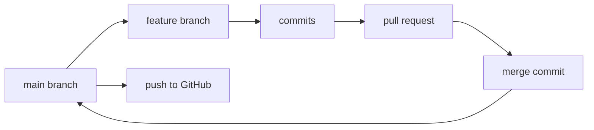
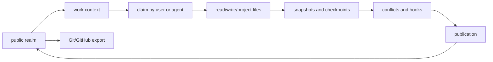

# Migrating From Git

Glyph does not try to make branches and commits friendlier. It replaces them with primitives that better match how humans and agents actually work: source views, work contexts, snapshots, and publications.

## Mental Model Shift

| In Git | In Glyph | Why it changes |
| --- | --- | --- |
| Repository | Source graph plus `.glyph/` store | The graph stores source, provenance, realms, work, claims, and publications. |
| Branch | Work context or realm | Active work and visibility boundaries are different things. |
| Commit | Snapshot, checkpoint, or publication | Glyph records progress continuously; publication is the intentional visibility event. |
| Pull request | Publication review or GitHub export artifact | Review is about moving work into a realm, not just merging a branch. |
| Working tree | Workspace projection | A workspace is a materialized view of a work context. |
| Remote origin | Glyph remote | GitHub can be used as infrastructure without becoming the canonical model. |
| `.git/` | `.glyph/` | Glyph stores its local source-control database in `.glyph/`. |

## Git Flow



Git asks you to choose history shape while you are still discovering the work. That is tolerable for humans and clumsy for agents. Agents often need to try edits, checkpoint partial progress, coordinate with other agents, and only later decide what should become visible.

## Glyph Flow



Glyph separates three concerns that Git often blends together:

- **Where work starts:** the base realm, usually `public`.
- **Who is editing:** the work context and its claim.
- **When work becomes visible:** the publication event.

## The Hardest Part To Unlearn

Git trained us to ask "what branch am I on?" before almost everything. Glyph wants a different first question:

> What source view am I starting from, and what work context am I changing?

That shift matters because branch names often mix purpose, status, visibility, and collaboration. A branch called `security-fix` might mean:

- private until embargo ends
- actively edited by one maintainer
- ready for review but not public
- a patch that should eventually land in `main`

Glyph gives each of those meanings a place:

| Meaning | Glyph primitive |
| --- | --- |
| private until embargo ends | realm |
| actively edited by one maintainer | work context plus claim |
| ready for review | checkpoint or publication review state |
| eventually lands in main | publication to `public` |

Once those meanings are separate, the workflow becomes easier for agents to follow because each command has a narrow job.

## Common Workflow Translation

### Start A Feature

```sh
git checkout -b docs-update
```

becomes:

```sh
glyph work start docs-update --from public --json
glyph work claim docs-update --actor agent:codex:docs-update --mode exclusive --ttl 30m --json
```

The work context says what is being changed. The claim says who is actively editing it.

### Edit Files

Git usually lets tools edit the working tree directly, then asks you to stage and commit later:

```sh
git diff
git add .
git commit -m "Update docs"
```

Glyph lets agents use source-control-aware file operations:

```sh
glyph read docs-update README.md --json
glyph write docs-update README.md --reason "update docs overview" --json < README.md
glyph diff docs-update --json
glyph checkpoint docs-update --message "docs ready for review" --json
```

The important shift is that `--reason` and checkpoints record intent without forcing every intermediate state to become public history.

### Publish Work

```sh
git push origin docs-update
```

becomes:

```sh
glyph work conflicts docs-update --json
glyph hook run pre-publish --work docs-update --to public --mode squash --json
glyph publish docs-update --to public --mode squash --json
```

Publication is the moment the work becomes visible in the destination realm. Export to GitHub is a compatibility step after the realm changes:

```sh
glyph remote sync origin --json
```

## Why This Is A Better Fit For Agents

Agents are not just typing Git commands faster. They often run in parallel, operate through APIs, and need explicit context about identity, permissions, and publication intent.

Glyph gives them:

- stable work context names instead of temporary branches
- non-interactive JSON responses
- advisory claims and heartbeats
- source-aware read/write operations
- explicit publish modes
- private and public source views
- GitHub export without making GitHub the canonical model

The result is less ceremony during exploration and more control at the moment work becomes visible.
