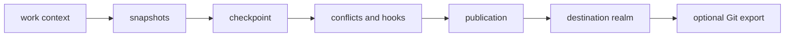
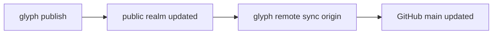

# Publications

A publication is the act of moving selected work into a destination realm.

Publication is not the same thing as a Git commit. A publication may export as one commit, multiple commits, a GitHub pull request, or another compatibility artifact.

## The Key Idea

Saving work and publishing work are different acts.

Git often blurs them because commits are both local checkpoints and the units that move through review and remotes. Glyph makes publication explicit: a work context can have many snapshots and checkpoints, but nothing changes in the destination realm until publication.



## What Publication Records

A publication should be able to answer:

- which work context was published
- which realm received it
- which mode was used
- which snapshots or checkpoints contributed
- which hooks ran
- which actor initiated the change
- which Git export commit represents it, if any

Prototype 0 implements only part of this, but the concept is designed around that audit trail.

## Modes

```sh
glyph publish auth-fix --to public --mode squash
glyph publish auth-fix --to public --mode preserve
```

- `squash`: public history sees one coherent event
- `preserve`: selected checkpoints can become visible history

In both modes, detailed Glyph history can remain privately retained according to policy.

## Review Before Publication

Publication is the right time to run conflict checks and hooks:

```sh
glyph work conflicts auth-fix --json
glyph hook run pre-publish --work auth-fix --to public --mode squash --json
glyph publish auth-fix --to public --mode squash --json
```

That keeps exploratory work cheap while making visibility changes deliberate.

## Publication Versus Remote Sync

Publication changes a Glyph realm. Remote sync exports that realm to another system:



This separation is important. GitHub can be a mirror, deployment trigger, or collaboration surface without being the place where Glyph's model is forced to collapse into branches and commits.
