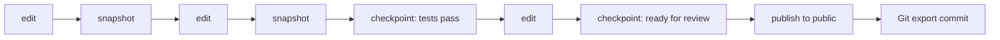
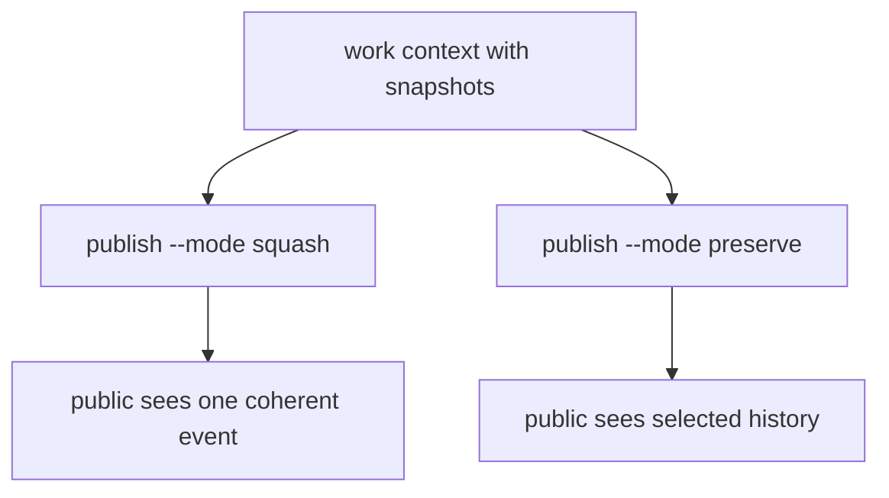

Git uses commits for many jobs. A commit can mean "save my work", "make CI run", "tell reviewers this is ready", "publish this change", or "record a release." That overload is one reason Git feels natural after years of use but strange to automate cleanly.

Glyph splits these meanings apart.

## Definitions

| Concept | Meaning |
| --- | --- |
| Snapshot | A captured source state inside a work context. |
| Checkpoint | A named milestone snapshot with human or agent intent. |
| Publication | A visibility change that moves selected work into a realm. |
| Export commit | A Git commit generated from a Glyph publication or compatibility operation. |

## Why This Matters

An agent may make many useful intermediate edits while solving a task. Some are exploratory. Some are partial. Some are real milestones. Git asks you to package those states as commits early. Glyph lets the work breathe first.



## Snapshot

A snapshot is source capture. It answers "what did this work context look like at this point?"

Prototype 0 exposes manual snapshots:

```sh
glyph work snapshot docs-update --json
```

As Glyph grows, many snapshots can be automatic. The important part is that a snapshot does not have to become public history.

## Checkpoint

A checkpoint is a milestone. It carries intent.

```sh
glyph checkpoint docs-update --message "docs ready for review" --json
```

Use checkpoints when a human or agent wants to say:

- this is worth reviewing
- tests pass here
- this is the handoff point
- this experiment produced something useful
- preserve this point if we publish with history

## Publication

A publication is the decision to make selected work visible in a realm:

```sh
glyph publish docs-update --to public --mode squash --json
```

Publication is closer to "merge this into the visible project" than "save my local work." That distinction is the heart of Glyph.

## Squash Or Preserve



Use `squash` when readers only need the final coherent change. Use `preserve` when the path matters, such as security review, multi-agent handoff, or design work where the reasoning trail should stay visible.

## How Git Sees It

GitHub still needs Git commits. Glyph can export a publication as one or more Git commits depending on compatibility mode. That exported commit is not the source of truth; it is a projection of the source graph.
