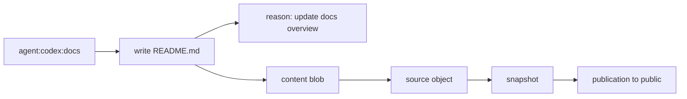
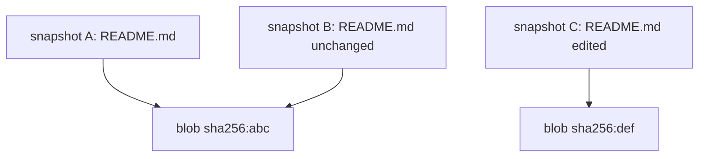

Git made the commit graph the center of source control. Glyph makes the source graph the center.

That sounds subtle, but it changes the whole shape of the system. In Git, every important thing eventually has to become a commit, branch, ref, index state, or working tree mutation. In Glyph, those are separate kinds of information in one graph: source states, content objects, work contexts, realms, claims, checkpoints, publications, remotes, and policy decisions.

## The Basic Shape

```mermaid
flowchart TD
  graph["source graph"] --> realms["realms"]
  graph --> work["work contexts"]
  graph --> objects["source objects"]
  graph --> content["content blobs"]
  graph --> snapshots["snapshots"]
  graph --> checkpoints["checkpoints"]
  graph --> publications["publications"]
  graph --> claims["claims"]
  graph --> remotes["remotes"]

  realms --> public["public"]
  realms --> maintainers["maintainers"]
  work --> docs["docs-update"]
  work --> fix["auth-fix"]
  publications --> export["Git/GitHub export"]
```

A source graph can answer questions that are awkward in Git:

- Which work contexts are active?
- Which actor currently claims this work?
- Which files changed because an agent wrote them?
- Which realm can see this source?
- Which private snapshots contributed to this public publication?
- Which generated Git commit represents this publication?

Git can store some of this through conventions. Glyph stores it as first-class data.

## Files Are Not The Whole Story

The source graph includes files, but it is not only a file tree. It also includes why and how those files changed.



That is the key difference for agent-native workflows. An agent can leave structured traces that are more meaningful than "some process changed the working tree."

## Logical State, Physical Deduplication

Glyph stores full file states logically. When you ask what a work context sees, the answer is a complete file state. Under the hood, repeated bytes are stored once in `.glyph/content/`.



This avoids making every feature depend on fragile patch chains. Glyph can present complete states while keeping storage size under control.

## Why Not Just Use Git Notes Or Metadata Files?

Git can be extended with metadata, but those extensions sit around the commit graph. That means the commit remains the gravity well: every idea has to attach to a commit, branch, tag, or ref.

Glyph reverses that relationship. Git becomes an export format. The source graph is allowed to model the real workflow directly, then produce Git history when GitHub or another Git tool needs it.

## What This Unlocks

- Private and public views over the same project.
- Work that can be coordinated before it becomes public.
- Agents that can read and write through stable JSON APIs.
- Multiple work contexts without forcing branch gymnastics.
- Publication decisions that can squash or preserve history later.
- Compatibility exports that do not dictate the internal model.
