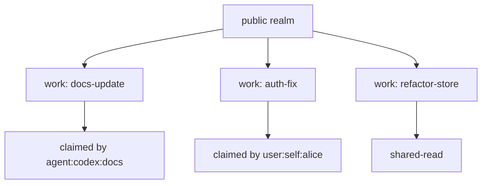
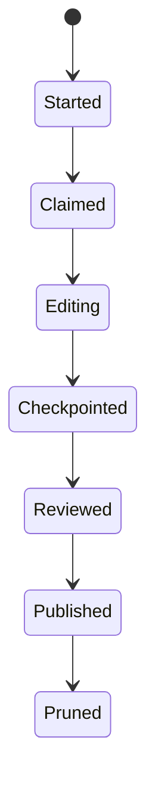
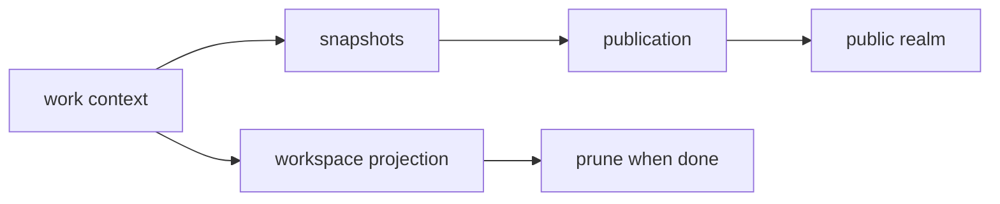

A work context is an isolated unit of active work.

It replaces the common branch plus working tree plus stash workflow with:

- a stable work name
- a base realm
- a workspace projection
- captured snapshots
- provenance
- optional agent claim
- review and publication state

Multiple agents can work from the same base realm at the same time. Glyph coordinates them through claims, dependencies, conflict detection, and explicit publication.

## Why Not Branches?

Branches are good at naming alternate Git histories. Active work is richer than that. A work context has a name, a base realm, source state, snapshots, claims, conflicts, dependencies, and publication status.



A branch can tell you where history diverged. A work context can tell you what is happening, who is doing it, and whether it is ready to publish.

## Work Context Lifecycle



Prototype 0 uses explicit commands for each important step:

```sh
glyph work start docs-update --from public --json
glyph work claim docs-update --actor agent:codex:docs --mode exclusive --ttl 30m --json
glyph write docs-update README.md --reason "update docs" --json < README.md
glyph checkpoint docs-update --message "ready for review" --json
glyph publish docs-update --to public --mode squash --json
glyph work prune docs-update --json
```

## Claims Are Coordination, Not Ownership

A claim says "this actor is actively working here." It is a concurrency signal for humans and agents. It is not the same as legal ownership, code ownership, or final approval.

```sh
glyph work claim auth-fix --actor agent:claude-code:auth --mode exclusive --ttl 15m --json
glyph work heartbeat auth-fix --actor agent:claude-code:auth --ttl 15m --json
glyph work release auth-fix --actor agent:claude-code:auth --json
```

Claims matter because agent workflows can overlap. Without a source-control-level signal, two agents can edit nearby files and only discover the collision at publish time.

## Projection Versus Graph

A workspace projection is the materialized files for a work context. The source graph is the durable model. This means a work projection can be pruned after the work is done without deleting the history that led to the publication.


